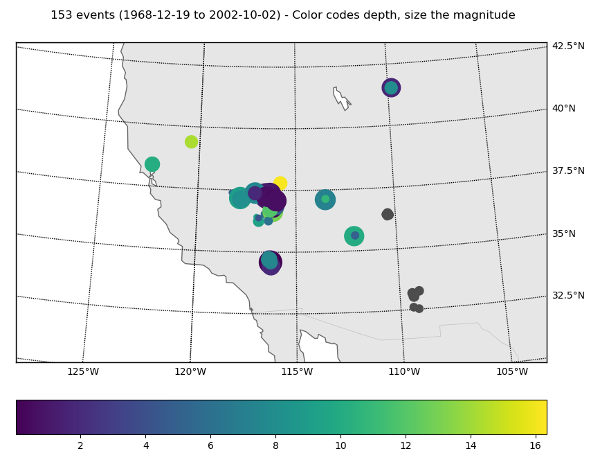
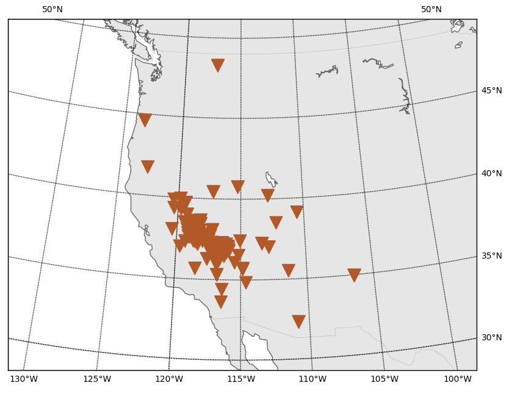

# LLNL Database Client

## Installation

Assuming you use conda, run (in the correct `conda` environment):

```bash
$ conda install -c conda-forge obspy pandas basemap pytest
```

Now grab this repository with git, and install it with `pip`. Make sure to
use the `-e` flag for an editable installation.

```bash
$ git clone https://github.com/krischer/llnl_db_client.git
$ cd llnl_db_client
$ pip install -v -e .
```

If you ever want to update the installation, just run

```bash
$ git pull
$ pip install -v -e .
```

within the repository.


### Running the Tests

This is currently only a regression test suite but it checks some things and
has 100% test coverage so at least the Python is correct. You need the
database to run the tests. `cd` to the `llnl_db_client` directory and run

```bash
$ LLNL_DB_PATH=/path/to/UCRL-MI-222502/westernus.wfdisc py.test
```

### Potential Pitfalls

* Essentially untested!
* This is not a proper CSS reader and should at one point probably replaced by
  something more solid, e.g. `obspy.io.css` or something else.
* The network code for all traces and the inventory information is always `LL`
  which might not play nice with other tools. There appears to be no network
  codes in the database so that is the best we can do.
* The reponses are a bit tricky, except the RESP files which are easy. The
  others follow this logic (**this might very well be wrong!!!**):
	* SACPZ files:
		* The client currently assumes they correct to displacement in 10E-6 meters! The only justification I have is that this puts the amplitudes in the same ballpark as those corrected for with evalresp.
	* Funky PAZ files:
		* The client currently assumes they correct to displacement in 10E5 meters! The only justification I have is that this puts the amplitudes in the same ballpark as those corrected for with evalresp.

## Usage

First initialize a client:

```python
from llnl_db_client import LLNLDBClient

c = LLNLDBClient("./UCRL-MI-222502/westernus.wfdisc")
```

Print some basic information:


```python
>>> print(c)
LLNL Database 'westernus' (/Users/lion/temp/LLNL_Alaska/LLNL/UCRL-MI-222502)
	11176 waveform files
	147 stations
```

Get a list of all events with:

```python
>>> c.list_events()
[592897, 2021892, ...]
```

Get an ObsPy `Stream` object with all waveforms for an event:

```python
>>> st = c.get_waveforms_for_event(592897)
>>> print(st)
44 Trace(s) in Stream:

.ELK..BBE | 1988-10-13T13:58:01.143010Z - 1988-10-13T14:07:01.118010Z | 40.0 Hz, 21600 samples
...
(42 other traces)
...
.NEL..SHZ | 1988-10-13T13:59:31.660000Z - 1988-10-13T14:05:02.640000Z | 50.0 Hz, 16550 samples

[Use "print(Stream.__str__(extended=True))" to print all Traces]
```

Instrument correction.

```python
# Has to be done manually!
>>> st.detrend("linear")
>>> st.taper(max_percentage=0.05, type="hann")

# Water level, output, and pre_filt are the same as in Trace.remove_response()
>>> c.remove_response(st, water_level=10, output="VEL", pre_filt=None)
```

Catalog and inventory objects

```python
# Get a single event objects.
>>> c.get_obspy_event(592897)
Event:	1988-10-13T14:00:00.080000Z | +37.089, -116.050 | 5.9 Mb

	         resource_id: ResourceIdentifier(id="smi:local/...")
	 preferred_origin_id: ResourceIdentifier(id="smi:local/...")
	                ---------
	  event_descriptions: 1 Elements
	               picks: 24 Elements
	             origins: 4 Elements
	          magnitudes: 6 Elements


# Get all events.
>>> c.get_catalog()
153 Event(s) in Catalog:
1988-10-13T14:00:00.080000Z | +37.089, -116.050 | 5.9 Mb
1999-03-24T21:07:33.430000Z | +36.399, -110.481 | 2.7 ML
...
1999-03-10T20:41:13.200000Z | +36.391, -110.326 | 3.1 ML
1999-08-02T05:40:26.580000Z | +37.381, -117.081 | 4.1 ML
To see all events call 'print(CatalogObject.__str__(print_all=True))'

# Get the full inventory
>>> c.get_inventory()
Inventory created at 2018-03-29T13:50:32.420334Z
	Created by: ObsPy 1.1.0
		    https://www.obspy.org
	Sending institution:
	Contains:
		Networks (1):
			LL
		Stations (147):
		    ...
```

Helper function to get a list of all unique channels.

```python
>>> c.get_unique_channels()
{('A5CSNV', 'EHE'),
 ('A5CSNV', 'EHN'),
 ('A5CSNV', 'EHZ'),
 ('A5NENV', 'EHE'),
 ...
```

### Plots

Plot a map of the database:

```python
>>> c.plot()
```


Same for only the events:

```python
>>> c.plot_events()
```




And for only the stations:

```python
>>> c.plot_stations()
```

